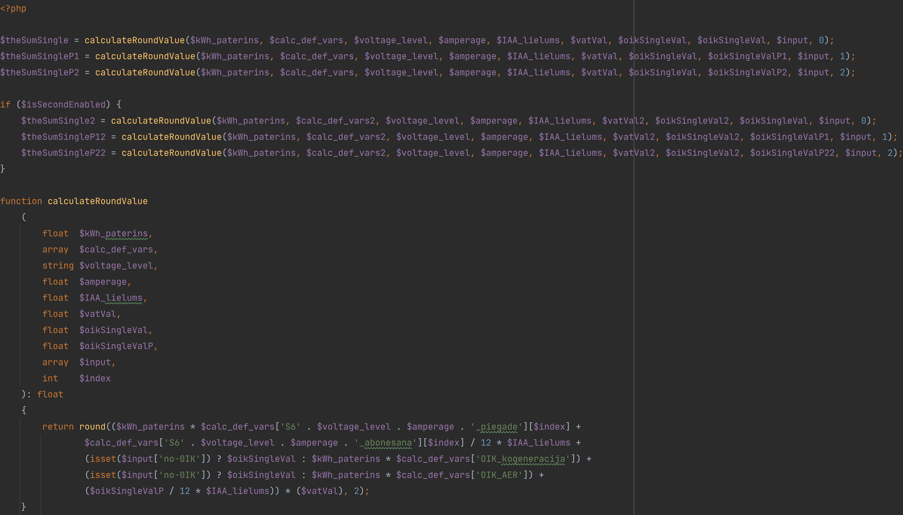

# Latvenergo praktiskais uzdevums

### 1. Ieviest jaunu lauku, pēc kura vēlāk tiks veikti aprēķini līdzīgi kā piemēra kodā. Pārrakstīt kodu, lai tas ir īsāks.

[Uzdevums1.php](./Uzdevums1.php)

### 2. Ja tiek padots `getData(a)` un `getData(z)` – kas tiek atgriezts? Varbūt var pateikt, ko funkcija dara.

Funkcija `getData()` ir publiska funkcija klasē, kura rezultātā atdod masīvu ar datiem.
Funkcijā iekļautas vairākas pārbaudes, no kuram nozīmīgākā ir pārbaude, vai datus var iegūt no kešatmiņas. Ja pieprasītie dati ir pieejami kešatmiņā, tad tie tiek atdoti.
Bet ja nepieciešamie dati neatrodas kešatmiņā, tad tiek izmantota klases funkcija `getContents()`, lai iegūtu datus no āreja pieparsījuma. Šos datus pieglabā mainīgajā `$applications`.
Tad nepieciešamie dati, izmantojot foreach ciklu, tiek iegūti no `$applications` mainīga un tiek pievienoti `$markers` masīvam, kas gan tiek atdots no funkcijas, gan tiek saglabāts kešatmiņā.

Pieņemot, ka funkcijā tiek padota `string` vērtība `"A"`, vispirms tiktu pārbaudīts vai datus var iegūt no kešatmiņas. Ja tos nevar iegūt no kešatmiņas, tad tiek pārbaudīts vai tips nav `"P"` un `"A"`.
Līdz ar to, ka tiek padots `"A"`, šī pārbaude neizpildās un `$marker` masīvs paliek bez vērtībām, tiek pieglabāts kešatmiņā un atdots no funkcijas.

Ja funkcijai tiek padota string vērtība `"Z"`, tad tiek pārbaudīts vai datus var iegūt no kešatmiņas. Ja tos nevar iegūt no kešatmiņas, tad tiek pārbaudīts vai tips nav `"P"` un `"A"`.
Līdz ar to, ka tiek padots `"Z"`, šī pārbaude izpildās un tiek izmantota klases funkcija `getContents()`, lai iegūtu datus no ārēja pieprasījuma. Šos datus pieglabā mainīgajā `$markers`,
kuri arī tiek pieglabāts kešatmiņā un atdoti no funkcijas.

### - Niks Kuprēvičs
